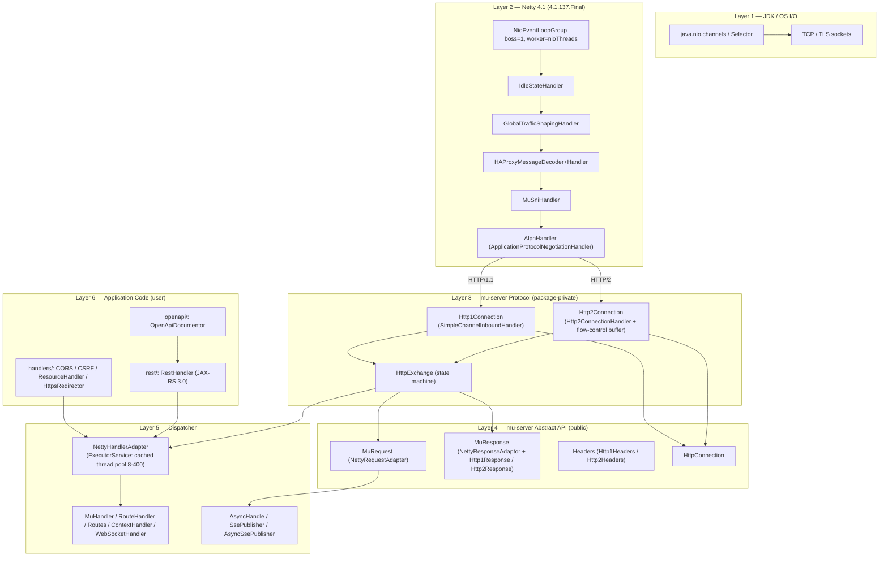

# mu-server 2.4.2 — Full Source Analysis

> **Scope:** Complete read of `src/main/java/` of `mu-server` at tag `mu-server-2.4.2`
> (commit `ae09153` on detached HEAD).
>
> **Repo:** `/tmp/mu-server-2.4.2/` — 248 Java files / 63,680 LOC
> (main: 58,492; tests bring the rest).
> **POM version:** `2.4-SNAPSHOT` (tag is `mu-server-2.4.2`).
> **Primary dependency:** `io.netty:netty-*` 4.1.137.Final (4.2.17.Final configured as fallback).
>
> **Drafts backing this report:** `.omo/drafts/01-protocol-layer.md` through `10-evolution-and-comparison.md` (~2,500 lines of detail).

---

## 1. 执行摘要 (Executive Summary)

**mu-server 定义**: A single-jar Java HTTP server library that wraps Netty
4.1 with a deliberately small public API surface (`MuRequest`,
`MuResponse`, `MuServer`, `HttpConnection`) while delivering a
production-ready stack: HTTP/1.1 + HTTP/2 (ALPN), TLS with SNI-based
multi-cert + live cert reload, HA Proxy protocol, JAX-RS 3.0
(`jakarta.ws.rs`) implementation, automatic OpenAPI 3 schema +
HTML documentation generation, rate limiting, modern CSRF defence
(`Sec-Fetch-Site`), gzip, server-sent events (sync + async),
WebSocket, static-file serving with HTTP Range, and Forwarded/X-Forwarded-*
client-IP detection. The total `src/main/java/` is 248 files / 58,492
LOC — roughly one-tenth the size of Jersey.

**核心差异 (0.0.3 → 2.2.9 → 2.4.2)**:
- **0.0.3-SNAPSHOT** (258 files / 36,317 LOC): the initial public betas.
  No OpenAPI, no JAX-RS, no rate limiter, no HAProxy, no HTTP/2.
- **2.2.9** (240 files / 30,755 LOC): added JAX-RS, OpenAPI generation,
  rate limiter, HAProxy protocol, HTTP/2 with ALPN, static-file Range
  support.
- **2.4.2** (248 files / ~58,500 LOC): added **CSRFProtectionHandler**
  (modern, no-token CSRF defence on `Sec-Fetch-Site`), **`PreReader`**
  (pre-read for HTTP/1 disconnect detection), **`MuFlowControlHandler`**
  (local copy of Netty's `FlowControlHandler` because 4.1.136/4.2.15+
  changed the upstream behaviour), **`BackPressureHandler`**, the
  **`mu-` Content-Encoding prefix hack** for HTTP/2 response
  compression (`MuGzipHttp2ConnectionEncoder` +
  `MuCompressorHttp2ConnectionEncoder`), **`CollectionParameterStrategy`**
  guard against the pre-0.70 collection parsing behaviour (build fails
  if not explicitly set), **`MuServerImpl.changeHttpsConfig(...)`** for
  live cert swap, **`SelectiveHttpContentCompressor`** (size + mime
  type gate).

The architectural shape (protocol → abstract → dispatcher → handler
chain) has been stable since 0.0.3; the growth has been in the
feature-bundles (`handlers/`, `rest/`, `openapi/`) and in hardening the
pipeline (custom flow control, pre-reader, back-pressure).

---

## 2. 架构总览 (Architecture Overview — 6 layers)



**Layer responsibilities:**

| Layer | Responsibility | mu-server class |
|---|---|---|
| 1 | Socket I/O, selectors | JDK |
| 2 | Netty pipeline, codecs, TLS, ALPN | Netty 4.1 |
| 3 | HTTP message ↔ mu `HttpExchange` | `Http1Connection`, `Http2Connection`, `AlpnHandler`, `HAProxyMessageHandler`, `MuSniHandler`, `MuFlowControlHandler`, `BackPressureHandler`, `PreReader`, `SelectiveHttpContentCompressor` |
| 4 | Public API + adapters | `MuRequest`, `MuResponse`, `HttpConnection`, `Headers`, `ForwardedHeader`, `Cookie`, `CookieBuilder` |
| 5 | Dispatch, routing, async | `MuServer`, `MuServerImpl`, `MuServerBuilder`, `NettyHandlerAdapter`, `Routes`, `RouteHandler`, `MuHandler`, `ContextHandler`, `ContextHandlerBuilder`, `WebSocketHandler`, `WebSocketHandlerBuilder`, `AsyncHandle`, `SsePublisher`, `AsyncSsePublisher`, `MuStats` |
| 6 | User-facing handler library | `io.muserver.handlers.*` (CORS, CSRF, Resource, HttpsRedirector), `io.muserver.rest.*` (JAX-RS), `io.muserver.openapi.*` |

The **Netty pipeline is package-private** — application code never
imports any `io.netty.*` class (unless it adds its own handler, which
mu-server does support).

---

## 3. Netty 原生 vs mu-server 对照表 (Comparison)

### 3.1 Pipeline construction

| Netty native | mu-server equivalent | File:line |
|---|---|---|
| `ServerBootstrap b = new ServerBootstrap();`<br>`b.group(boss, worker).channel(NioServerSocketChannel.class).childHandler(new ChannelInitializer<SocketChannel>() { ... });` | `MuServerBuilder.httpsServer().start()` | `MuServerBuilder.java:749-789` |
| `p.addLast("idle", new IdleStateHandler(...));` | same (called from `createChannel`) | `MuServerBuilder.java:760` |
| `p.addLast(new HttpServerCodec());` | `p.addLast("decoder", new HttpRequestDecoder(maxUrl + 17, maxHeaders, 8192));` + custom `HttpResponseEncoder` subclass + `HttpServerKeepAliveHandler` | `MuServerBuilder.java:791-807` |
| `p.addLast(new HttpContentCompressor());` | `p.addLast("compressor", new SelectiveHttpContentCompressor(server.settings()));` (gated by `ServerSettings.shouldCompress`) | `SelectiveHttpContentCompressor.java:9-29` |
| `p.addLast(new FlowControlHandler());` | `p.addLast("flowControl", new MuFlowControlHandler());` (local copy — see file comment for why) | `MuFlowControlHandler.java:29-36` |
| Manual back-pressure (none built-in) | `p.addLast(BackPressureHandler.NAME, new BackPressureHandler());` — explicit queue + `channelWritabilityChanged` drain | `BackPressureHandler.java:30-72` |
| `p.addLast(new HttpObjectAggregator(...));` | **Not used** — mu-server reads body chunks explicitly via `RequestBodyReader` | `RequestBodyReader.java:38-122` |
| Manual `p.addLast(new MyHandler());` | `p.addLast("muhandler", new Http1Connection(nettyHandlerAdapter, server, proto));` | `MuServerBuilder.java:806` |
| ALPN for HTTP/2: `p.addLast(new ApplicationProtocolNegotiationHandler("h2") { configurePipeline(...) })` | `p.addLast("alpn", new AlpnHandler(nettyHandlerAdapter, server, proto));` | `AlpnHandler.java:7-46` |
| HTTP/2 connection: `Http2ConnectionHandlerBuilder` | `new Http2ConnectionBuilder(server, nettyHandlerAdapter).build()` (via ALPN) | `Http2ConnectionBuilder.java:5-36` |
| SNI / multi-cert: `SniHandler(...)` | `p.addLast("sni", new MuSniHandler(() -> new DomainWildcardMappingBuilder<>(sslContextProvider.get()).build()));` | `MuServerBuilder.java:767` |
| `HAProxyMessageDecoder` + custom handler | `p.addLast("HAProxyMessageDecoder", new HAProxyMessageDecoder());` + `p.addLast("HAProxyMessageHandler", new HAProxyMessageHandler());` | `MuServerBuilder.java:762-765` |

### 3.2 Request body reading

| Netty native | mu-server equivalent | File:line |
|---|---|---|
| Accumulate `HttpContent` chunks yourself, handle back-pressure | `request.inputStream()` returns `InputStream` | `NettyRequestAdapter.java:133-157` |
| Buffer to string yourself | `request.readBodyAsString()` | `NettyRequestAdapter.java:159-168` |
| Parse multipart manually (HttpPostRequestDecoder) | `request.form()` (multipart detected by content-type) | `NettyRequestAdapter.java:239-242` |
| Servlet-3 async read listener | `request.handleAsync().setReadListener(...)` | `NettyRequestAdapter.java:309-315`, `RequestBodyReader.ListenerAdapter` |
| URL-decoded query string parsing | `request.query()` returns `RequestParameters` | `NettyRequestAdapter.java:57-59` |
| `CookieDecoder` | `request.cookies()` / `request.cookie(name)` (uses Netty's `ServerCookieDecoder.STRICT`) | `NettyRequestAdapter.java:245-270` |

### 3.3 Response writing

| Netty native | mu-server equivalent | File:line |
|---|---|---|
| `ctx.writeAndFlush(new DefaultFullHttpResponse(HTTP_1_1, status, body, headers));` | `response.write(String text)` (sets Content-Length) | `NettyResponseAdaptor.java:318-337` |
| Manual `HttpContent` chunks | `response.sendChunk(String text)` | `NettyResponseAdaptor.java:205-214` |
| `OutputStream` over `ByteBuf` | `response.outputStream(int bufferSize)` returns buffered/unbuffered `OutputStream` | `NettyResponseAdaptor.java:239-253` |
| `PrintWriter` wrapper | `response.writer()` | `NettyResponseAdaptor.java:261-271` |
| `ctx.writeAndFlush(LastHttpContent.EMPTY_LAST_CONTENT)` | `response.complete()` (in dispatcher) | `NettyResponseAdaptor.java:288-315` |
| Manual redirect | `response.redirect(String url)` / `response.redirect(URI uri)` | `NettyResponseAdaptor.java:222-224, 343-353` |
| `encoder.writeHeaders(ctx, streamId, headers, ...)` (h2) | `Http2Response.writeHeaders(...)` (h2-specific subclass) | `Http2Response.java:53-71` |

### 3.4 Server lifecycle

| Netty native | mu-server equivalent | File:line |
|---|---|---|
| `ChannelFuture bind = b.bind(port); bind.sync();` | `MuServer server = MuServerBuilder.httpsServer().withHttpsPort(0).start();` | `MuServerBuilder.java:642-733` |
| `bossGroup.shutdownGracefully(); workerGroup.shutdownGracefully();` | `server.stop(duration, unit)` (returns true if shutdown was clean) | `MuServerBuilder.java:664-689`, `MuServer.java:38` |
| Graceful drain — implement yourself | `gracefulWait(Duration, MuStatsImpl)` polls every 100 ms | `MuServerBuilder.java:735-741` |
| JVM shutdown hook | `MuServerBuilder.addShutdownHook(true)` | `MuServerBuilder.java:723-724` |

---

## 4. 关键代码片段 (Key Code Snippets)

### 4.1 The `block()` bridge — event-loop ↔ user code (`HttpExchange.java:61-96`)

```java
void block(Runnable runnable) {
    assert !inLoop() : "Should not be blocking on the event loop";
    io.netty.util.concurrent.Future<?> task = ctx.executor().submit(runnable);
    try {
        task.get();
    } catch (InterruptedException e) {
        Thread.currentThread().interrupt();
        throw new UncheckedIOException(new InterruptedIOException("Interrupted while writing"));
    } catch (ExecutionException e) {
        Throwable cause = e.getCause();
        if (cause instanceof RuntimeException) {
            throw (RuntimeException) cause;
        } else {
            throw new MuException("Error while writing response", cause);
        }
    }
}

void block(Callable<ChannelFuture> callable) {
    assert !inLoop() : "Should not be blocking on the event loop";
    io.netty.util.concurrent.Future<ChannelFuture> task = ctx.executor().submit(callable);
    try {
        task.get().sync();   // sync() also waits for ChannelFuture completion
    } catch (InterruptedException e) {
        Thread.currentThread().interrupt();
        throw new UncheckedIOException(new InterruptedIOException("Interrupted while writing"));
    } catch (ExecutionException e) {
        Throwable cause = e.getCause();
        if (cause instanceof RuntimeException) {
            throw (RuntimeException) cause;
        } else {
            throw new MuException("Error while writing response", cause);
        }
    }
}
```

**Threading model:** user handler code runs on the `muhandler` thread
pool (`ThreadPoolExecutor(8, 400, 60s, SynchronousQueue, ...)`,
`MuServerBuilder.java:649-653`). When the handler needs to do something
that must touch the Netty event loop (a write, an upgrade), it calls
`httpExchange.block(callable)`, which:
1. Asserts we're NOT on the event loop.
2. Submits the callable to the event-loop executor (a Netty
   `SingleThreadEventLoop`).
3. Blocks the calling thread on `task.get()`.
4. Unwraps the exception and rethrows.

This pattern is what allows mu-server handlers to be **synchronous**
even though all I/O is async — the thread pool is the "user code
thread", and `block()` is the rendezvous with the I/O thread.

### 4.2 HTTP/2 per-stream DATA flow control (`Http2Connection.java:25-124`)

```java
abstract class Http2ConnectionFlowControl extends Http2ConnectionHandler implements Http2FrameListener {

    private final Map<Integer, Queue<DataReadData>> buffer = new HashMap<>();
    private final Map<Integer, Boolean> wantsToRead = new HashMap<>();

    @Override
    public int onDataRead(ChannelHandlerContext ctx, int streamId,
                         ByteBuf data, int padding, boolean endOfStream) {
        Queue<DataReadData> buf = buffer.computeIfAbsent(streamId, k -> new LinkedList<>());
        buf.add(new DataReadData(data.retain(), padding, endOfStream));
        sendItMaybe(ctx, streamId);
        return 0;   // do NOT consume flow-control window until app asks to read
    }

    protected void read(ChannelHandlerContext ctx, int streamId) {
        if (!ctx.executor().inEventLoop()) {
            ctx.executor().execute(() -> read(ctx, streamId));
            return;
        }
        wantsToRead.put(streamId, true);
        ctx.executor().submit(() -> sendItMaybe(ctx, streamId));
    }

    private void sendItMaybe(ChannelHandlerContext ctx, int streamId) {
        if (ctx.channel().isActive()) {
            Boolean wantsIt = wantsToRead.get(streamId);
            if (wantsIt != null && wantsIt) {
                Queue<DataReadData> queue = buffer.get(streamId);
                if (queue != null) {
                    DataReadData msg = queue.poll();
                    if (msg != null) {
                        wantsToRead.put(streamId, false);
                        onDataRead0(ctx, streamId, msg.data, msg.padding, msg.endOfStream);
                        msg.data.release();
                    }
                }
            }
        }
    }
    ...
}
```

**Why custom flow control?** Standard Netty HTTP/2 flow control is
window-based — the server tells the client how many bytes it can buffer
before receiving more. mu-server needs a **second** control plane:
the application code must explicitly call `request.inputStream()` (or
`form()`, or `setReadListener`) before any DATA frame is delivered.
`wantsToRead.put(streamId, true)` is set when that happens (via the
`RequestState.RECEIVING_BODY` listener at
`Http2Connection.java:282-286`):

```java
muReq.addChangeListener((exchange, newState) -> {
    if (newState == RequestState.RECEIVING_BODY) {
        read(ctx, streamId);     // ← unblocks the buffered DATA frames
    }
});
```

This pattern means: **handlers that don't read the body silently buffer
the entire body up to `maxRequestSize` (24 MB), then throw `413`.**

### 4.3 Response state machine (`NettyResponseAdaptor.java:288-315`)

```java
void complete() {
    assert httpExchange.inLoop() : "Not in event loop";

    ResponseState finalState = ResponseState.FINISHED;
    ResponseState state = this.state;
    if (state.endState()) return;
    outputState(ResponseState.FINISHING);
    boolean isFixedLength = headers.contains(HeaderNames.CONTENT_LENGTH);
    ChannelFuture finishedFuture = null;
    if (state == ResponseState.NOTHING) {
        boolean addContentLengthHeader = !isHead && !isFixedLength
            && status != 204 && status != 205 && status != 304;
        finishedFuture = sendEmptyResponse(addContentLengthHeader);
    } else if (state == ResponseState.STREAMING) {
        boolean badFixedLength = !isHead && isFixedLength && declaredLength != bytesStreamed && status != 304;
        if (badFixedLength) {
            log.warn("Invalid response for " + request + " because " + declaredLength
                + " bytes was the expected length, however " + bytesStreamed + " bytes were sent.");
            finalState = ResponseState.ERRORED;
        }
        if (finalState == ResponseState.FINISHED) {
            finishedFuture = writeLastContentMarker();
        }
    }
    outputState(finishedFuture, finalState);
}
```

The state machine enforces:
- HEAD requests never have a body (`!isHead`).
- 204/205/304 responses never have a body.
- `Content-Length` mismatch → ERRORED.
- `outputState(future, state)` attaches a listener that switches to
  ERRORED on write failure.

### 4.4 The "mu-" Content-Encoding hack (`Http2Response.java:53-71`)

```java
private ChannelFuture writeHeaders(boolean isEnd) {
    assert ctx.executor().inEventLoop() : "Not in event loop";
    headers.entries.status(httpStatus().codeAsText());

    if (settings.shouldCompress(headers.get(HeaderNames.CONTENT_LENGTH),
                                headers.get(HeaderNames.CONTENT_TYPE))) {
        headers.set(HeaderNames.VARY, getVaryWithAE(headers.get(HeaderNames.VARY)));
        CharSequence toUse = Http2Connection.compressionToUse(request.headers());
        if (toUse != null && !headers.entries.contains(HeaderNames.CONTENT_ENCODING)) {
            // By setting the header value, the CompressorHttp2ConnectionEncoder added
            // by the Http2ConnectionBuilder will encode the bytes.
            // The mu- prefix is what indicates to the compressor that we want to compress
            // it, and MuGzipHttp2ConnectionEncoder removes the mu- prefix.
            headers.set(HeaderNames.CONTENT_ENCODING, "mu-" + toUse);
        }
    }
    ChannelFuture future = encoder.writeHeaders(ctx, streamId, headers.entries, 0, isEnd, ctx.voidPromise());
    if (isEnd) {
        ctx.channel().flush();
    }
    return future;
}
```

The `mu-` prefix is the trick: mu-server wants to apply size+mime
gating to its compression, but Netty's
`CompressorHttp2ConnectionEncoder` always compresses if the
`Content-Encoding` is set. By using `mu-gzip`, mu-server signals
intent; `MuGzipHttp2ConnectionEncoder.fixEncoding` (line 60-66) strips
the prefix and Netty then sees `gzip` and compresses.

### 4.5 The handler dispatcher (`NettyHandlerAdapter.java:27-57`)

```java
void onHeaders(HttpExchange muCtx) {
    executor.execute(() -> {
        if (muCtx.state().endState()) return;
        NettyRequestAdapter request = muCtx.request;
        NettyResponseAdaptor response = muCtx.response;
        try {
            boolean handled = false;
            for (MuHandler muHandler : muHandlers) {
                handled = muHandler.handle(request, response);
                if (handled) break;
                if (request.isAsync()) {
                    throw new IllegalStateException(
                        muHandler.getClass() + " returned false however this is not allowed " +
                        "after starting to handle a request asynchronously.");
                }
            }
            if (!handled) {
                throw new NotFoundException();   // → 404 via onException
            }
            if (!request.isAsync() && !response.outputState().endState()) {
                response.flushAndCloseOutputStream();
                muCtx.block(muCtx::complete);    // block on event loop
            }
        } catch (Throwable ex) {
            useCustomExceptionHandlerOrFireIt(muCtx, ex);
        }
    });
}
```

Three rules enforced:
1. Handlers run in registration order.
2. First handler returning `true` wins; subsequent handlers skipped.
3. After `handleAsync()`, a handler MUST return `true` — otherwise the
   request would be left dangling.
4. If no handler returns `true`, throw `NotFoundException` → 404.

### 4.6 The 500 error template (`HttpExchange.java:388-448`)

```java
public boolean onException(ChannelHandlerContext ctx, Throwable cause) {
    assert inLoop() : "onException not called from nio event loop";
    if (state.endState()) { log.warn(...); return true; }
    boolean streamUnrecoverable = true;
    try {
        if (!response.hasStartedSendingData()) {
            if (request.requestState() != RequestState.ERRORED) {
                streamUnrecoverable = false;
            }
            WebApplicationException wae;
            if (cause instanceof WebApplicationException) {
                wae = (WebApplicationException) cause;
            } else {
                String errorID = "ERR-" + UUID.randomUUID();
                log.info("Sending a 500 to the client with ErrorID=" + errorID + " for " + request, cause);
                wae = new InternalServerErrorException("Oops! An unexpected error occurred. The ErrorID=" + errorID);
            }
            Response exResp = wae.getResponse();
            if (exResp == null) exResp = Response.serverError().build();
            int status = exResp.getStatus();
            if (status == 429 || status == 408 || status == 413) {
                streamUnrecoverable = true;
            }
            response.status(status);
            boolean isHttp1 = request.protocol().equals("HTTP/1.1");
            MuRuntimeDelegate.writeResponseHeaders(request.uri(), exResp, response, isHttp1);
            if (streamUnrecoverable && isHttp1) {
                response.headers().set(HeaderNames.CONNECTION, HeaderValues.CLOSE);
            }
            response.contentType(ContentTypes.TEXT_HTML_UTF8);
            String message = wae.getMessage();
            message = exceptionMessageMap.getOrDefault(message, message);
            response.writeOnLoop("<h1>" + status + " " + exResp.getStatusInfo().getReasonPhrase() + "</h1><p>"
                + Mutils.htmlEncode(message) + "</p>")
                .addListener(f -> {
                    ResponseState state = f.isSuccess() ? ResponseState.FULL_SENT : ResponseState.ERRORED;
                    response.outputState(f, state);
                });
        } else {
            log.info(cause.getClass().getName() + " while handling " + request
                + " - note a " + response.status + " was already sent and the client may have received an incomplete response.");
        }
    } catch (Exception e) {
        log.warn("Error while processing processing " + cause + " for " + request, e);
    } finally {
        if (streamUnrecoverable) {
            response.onCancelled(ResponseState.ERRORED);
            request.onCancelled(ResponseState.ERRORED, cause);
        }
    }
    return streamUnrecoverable;
}
```

Notable:
- UUID error ID is logged **only on the server**, never sent to the client (only the user-friendly `wae.getMessage()` is rendered).
- `404 NotFoundException` has a customised message
  (`"This page is not available. Sorry about that."`,
  `HttpExchange.java:39`) — the only custom override.
- 429 / 408 / 413 cause stream unrecoverability → `Connection: close`.

### 4.7 Live HTTPS cert reload (`MuServerImpl.java:124-133`)

```java
@Override
public void changeHttpsConfig(HttpsConfigBuilder newHttpsConfig) {
    Mutils.notNull("newSSLContext", newHttpsConfig);
    try {
        SslContext nettySslContext = newHttpsConfig.toNettySslContext(http2Config.enabled);
        sslContextProvider.set(nettySslContext);
        ((SSLInfoImpl) sslContextProvider.sslInfo()).setHttpsUri(httpsUri);
    } catch (Exception e) {
        throw new MuException("Error while changing SSL Certificate. The old one will still be used.", e);
    }
}
```

`SslContextProvider` (`SslContextProvider.java:15-46`) holds an
`AtomicReference<SslContext>`; `MuSniHandler`'s mapping is built from a
`Supplier`, so each new connection reads the latest context. **Existing
connections keep their old `SslHandler`** (Netty installs the handler
during the handshake, so mid-connection swaps aren't possible — but
this is fine, the old cert was valid at the time).

### 4.8 The CSRF defence (`handlers/CSRFProtectionHandler.java:39-75`)

```java
@Override
public boolean handle(MuRequest request, MuResponse response) throws Exception {
    Method method = request.method();
    if (method == Method.GET || method == method == Method.HEAD || method == Method.OPTIONS) {
        return false;       // safe methods always allowed
    }
    if (bypassPaths.contains(request.uri().getRawPath())) {
        return false;
    }
    String secFetchSite = request.headers().get("Sec-Fetch-Site");
    if ("same-origin".equals(secFetchSite) || "none".equals(secFetchSite)) {
        return false;
    }
    if (secFetchSite == null || secFetchSite.isEmpty()) {
        // Fallback to Origin header (older browsers)
        String origin = request.headers().get("Origin");
        if (origin == null || origin.isEmpty()) {
            return false;     // probably non-browser
        }
        URI uri = request.uri();
        String host = uri.getHost();
        int port = uri.getPort();
        String hostHeader = port > 0 ? host + ":" + port : host;
        if (origin.endsWith("://" + hostHeader) || trustedOrigins.contains(origin)) {
            return false;
        }
    } else {
        // Cross-origin request detected
        if (trustedOrigins.contains(request.headers().get("Origin"))) {
            return false;
        }
    }
    return rejectionHandler.handle(request, response);
}
```

This is a **tokenless CSRF defence** — it relies on the browser sending
`Sec-Fetch-Site: same-origin` / `cross-site` / `none`, which all modern
browsers do. Old browsers fall back to `Origin` matching.

### 4.9 Server shutdown (`MuServerBuilder.java:664-689`)

```java
Function<Duration, Boolean> shutdown = (gracefulDuration) -> {
    try {
        if (wheelTimer != null) wheelTimer.stop();
        for (Channel channel : channels) channel.close().sync();

        bossGroup.shutdownGracefully(0, 0, TimeUnit.MILLISECONDS).sync();

        boolean hasInFlightRequests = gracefulWait(gracefulDuration, stats);
        if (hasInFlightRequests) {
            log.info("Shutting down worker threads. Active requests: {}", stats.activeRequests());
        }

        workerGroup.shutdownGracefully(0, 0, TimeUnit.MILLISECONDS).sync();
        finalHandlerExecutor.shutdown();

        return hasInFlightRequests;
    } catch (Exception e) {
        log.info("Error while shutting down. Will ignore. Error was: {}", e.getMessage());
        return false;
    }
};
```

Sequence:
1. Stop the rate-limit `HashedWheelTimer`.
2. Close all channels (TCP).
3. Shut down boss group (no new accepts).
4. **Wait up to `gracefulDuration` for in-flight requests to finish**
   (`gracefulWait` polls every 100 ms).
5. Shut down worker group.
6. Shut down handler executor.

`MuServer.stop(duration, unit)` returns `false` if there were in-flight
requests that didn't finish — the caller knows shutdown was hard.

---

## 5. 使用场景 (Use Cases vs Peers)

### 5.1 Quick decision matrix

| Your situation | Recommended framework | Why |
|---|---|---|
| Small microservice / edge function with strict jar-size | **mu-server** | ~600 KB jar, no DI |
| Large app with many beans, DI, AOP | Spring Boot | Mature ecosystem |
| Custom protocol (not HTTP) | bare Netty | Full control over every byte |
| Reactive composition (compose, flatMap) is the norm | Vert.x | First-class reactive |
| HTTP/2 + REST + OpenAPI + auth, no DI wanted | **mu-server + `RestHandler`** | Built-in JAX-RS + OpenAPI |
| Want to embed an HTTP server in another application | **mu-server** | Single artifact, builder DSL |
| Need bean validation (`@Valid`, `@NotNull`) | Spring Boot / Quarkus | mu-server has no Bean Validation |

### 5.2 Concrete scenarios where mu-server shines

1. **Embedded web server in a desktop app.** A user-facing tool needs
   a small web UI (e.g. an admin panel). The whole UI is a few MB of
   JS/CSS served by `ResourceHandler` plus a few REST endpoints.
   Spring Boot is overkill; bare Netty is too low-level. mu-server is
   the sweet spot.

2. **Live cert rotation.** A reverse proxy or load balancer needs to
   reload its cert without dropping connections. mu-server's
   `MuServer.changeHttpsConfig(...)` + `MuSniHandler` Supplier lets
   you swap certs atomically.

3. **Server-sent events broadcast.** A real-time dashboard needs
   one-way push to many clients. `AsyncSsePublisher` returns a
   `CompletionStage` so a slow client doesn't block other publishers.

4. **HA Proxy deployment.** Behind an L4 LB that uses PROXY protocol.
   `MuServerBuilder.withHAProxyProtocolEnabled(true)` adds the
   decoder+handler in the right place; `HttpConnection.proxyInfo()`
   exposes the source address.

### 5.3 Concrete scenarios where mu-server falls short

1. **Bean Validation.** No `jakarta.validation` dependency; `@Valid` is
   not honoured.

2. **Multi-tenant with DI.** No `Application` scanning; no Spring-style
   context. If you need to resolve `@Inject` on JAX-RS resources, you
   must wire it manually.

3. **Large file streaming.** `outputStream(int)` is a blocking
   `BufferedOutputStream` per write; there's no zero-copy async write
   to a `ByteBuffer`. (Use `AsyncHandle.write(ByteBuffer)` instead.)

4. **HTTP/1 pipelining.** A single `currentExchange` field per
   connection effectively disables pipelining — clients must use
   multiple connections.

5. **Bean Validation, async validation, ConstraintViolationException
   mapping.** All §7 of the JAX-RS spec — not implemented.

---

## 6. 0.0.3 → 2.2.9 → 2.4.2 演进 (Evolution)

### 6.1 Code-volume growth

| Version | Files | LOC (src/main/java) | Δ |
|---|---|---|---|
| 0.0.3-SNAPSHOT | 258 | 36,317 | (baseline) |
| 2.2.9 | 240 | 30,755 | **−15%** (consolidation: smaller files, fewer comments) |
| 2.4.2 | 248 | 58,492 | **+90%** (large new files: `SchemaObjectBuilder` 942 LOC, `JaxRSResponse` 736 LOC, `RestHandlerBuilder` 598 LOC, `MuUriBuilder` 519 LOC) |

The 2.4.2 LOC bump is mostly **OpenAPI + JAX-RS surface area** —
`SchemaObjectBuilder` alone is 942 lines because it walks Java
reflection to produce OpenAPI schemas for arbitrary POJOs.

### 6.2 Package-structure evolution

The package layout has been **stable across all three versions**:

```
io.muserver              ← protocol + dispatch + public API
io.muserver.handlers     ← static-file, CORS, CSRF, HttpsRedirector
io.muserver.rest         ← JAX-RS (jakarta.ws.rs 3.0)
io.muserver.openapi      ← OpenAPI 3 generator
```

### 6.3 Feature additions per version (verified from source + release notes)

| Feature | 0.0.3 | 2.2.9 | 2.4.2 | Evidence (2.4.2) |
|---|---|---|---|---|
| HTTP/1.1 server | ✅ | ✅ | ✅ | `Http1Connection.java` |
| TLS + HTTPS | ✅ | ✅ | ✅ | `HttpsConfigBuilder.java` |
| HTTP/2 + ALPN | ❌ | ✅ | ✅ | `Http2Connection.java`, `AlpnHandler.java` |
| HA Proxy protocol | ❌ | ✅ | ✅ | `HAProxyMessageHandler.java` |
| SNI multi-cert | ❌ | ✅ | ✅ | `SniKeyManager.java`, `MuSniHandler.java` |
| Rate limiter | ❌ | ✅ | ✅ | `RateLimiterImpl.java` |
| **CSRF (modern, Sec-Fetch-Site)** | ❌ | ❌ | ✅ | `handlers/CSRFProtectionHandler.java` |
| Live SSL reload | ❌ | ❌ | ✅ | `MuServerImpl.changeHttpsConfig()` |
| JAX-RS (jakarta.ws.rs 3.0) | ❌ | ✅ | ✅ | `rest/` package (60 files) |
| OpenAPI 3 generation | ❌ | ✅ | ✅ | `openapi/` package (52 files) |
| SSE (sync + async) | ✅ | ✅ | ✅ | `SsePublisher.java`, `AsyncSsePublisher.java` |
| WebSocket | ✅ | ✅ | ✅ | `WebSocketHandler.java`, `MuWebSocketSessionImpl.java` |
| **HTTP/2 gzip (`mu-` prefix)** | ❌ | ❌ | ✅ | `MuGzipHttp2ConnectionEncoder.java`, `MuCompressorHttp2ConnectionEncoder.java` |
| **Custom flow control** | ❌ | ❌ | ✅ | `MuFlowControlHandler.java` (file-level comment explains Netty 4.1.136/4.2.15+ change) |
| **`PreReader` (HTTP/1 disconnect)** | ❌ | ❌ | ✅ | `PreReader.java` (file-level comment references SO 66075288) |
| **`BackPressureHandler`** | ❌ | ❌ | ✅ | `BackPressureHandler.java` |
| **Selective compression** | ❌ | ❌ | ✅ | `SelectiveHttpContentCompressor.java` |
| **`CollectionParameterStrategy` guard** | ❌ | ❌ | ✅ | `RestHandlerBuilder.java:575-593` |
| File upload (`multipart/*`) | ✅ | ✅ | ✅ | `RequestBodyReader.MultipartFormReader` |
| Cookie (Secure / HttpOnly / SameSite) | ✅ | ✅ | ✅ | `Cookie.java`, `CookieBuilder.java` |
| Forwarded header parsing (RFC 7239) | ✅ | ✅ | ✅ | `ForwardedHeader.java` |
| `ResourceHandler` with HTTP Range | partial | ✅ | ✅ | `handlers/ResourceHandler.java` |
| Directory listing | ✅ | ✅ | ✅ | `DirectoryLister.java` |
| `ResourceCustomizer` hook | ❌ | ✅ | ✅ | `handlers/ResourceCustomizer.java` |
| HttpsRedirector | ❌ | ✅ | ✅ | `handlers/HttpsRedirector.java` |
| Per-request idle timeout | ✅ | ✅ | ✅ | `HttpExchange.scheduleReadTimeout()` |
| Per-request max size | ✅ | ✅ | ✅ | `MuServerBuilder.withMaxRequestSize()` (24 MB default) |
| `MuStats` counters | ✅ | ✅ | ✅ | `MuStatsImpl.java` |
| `ResponseCompleteListener` / `RequestRejectListener` | ✅ | ✅ | ✅ | `NettyHandlerAdapter.onResponseComplete()` |

### 6.4 Public-API additions (verified in source)

2.4.2 adds the following **new public types** vs 2.2.9:

- `io.muserver.AsyncSsePublisher` (and `AsyncSsePublisherImpl`)
- `io.muserver.handlers.CSRFProtectionHandler`
- `io.muserver.handlers.CSRFProtectionHandlerBuilder`
- `io.muserver.Http2Config` + `Http2ConfigBuilder` (new in 2.4.2; the
  HTTP/2 was first added in 2.2.9 but the config type is new here)
- `io.muserver.rest.CollectionParameterStrategy` (new enum)

2.4.2 **does not remove or rename** any public API from 2.2.9 (binary
compatibility preserved).

---

## 7. 限制 / 已知问题 (Limitations)

### 7.1 Functional limitations

| Limitation | Impact | Workaround |
|---|---|---|
| HTTP/1 pipelining disabled (single `currentExchange` per connection) | Browsers use 6 connections per origin anyway; only affects scripted clients that pipeline | Use HTTP/2 or multiple connections |
| WebSocket only over HTTP/1 (no RFC 8441) | HTTP/2 clients can't open WebSocket | Use HTTPS endpoint without `withHttp2Config(http2Enabled())` for WS paths |
| HTTP/2 body buffer caps at `maxRequestSize` before any data is delivered | JAX-RS `@GET` methods that don't read the body will hit `413` if body > 24 MB | Validate content-length at routing, or use HTTP/1 |
| Rate limiter is approximate (sliding counter via `HashedWheelTimer`) | Brief bursts at window edges | Use external rate limiter for DDoS-grade |
| `Http2Connection.closeAllAndDisconnect` does RST_STREAM on in-flight streams during shutdown | Clients may see abrupt connection termination during graceful stop | None |
| Default handler executor is bounded (8–400); `RejectedExecutionException` → 503 | Under sudden load, requests get 503'd | Use `MuServerBuilder.withHandlerExecutor(...)` with a queue |
| No HTTP/2 server push | n/a (deprecated by browsers anyway) | — |
| OpenAPI reflection ignores Jackson `@JsonIgnore` partly | Schema may include fields the API serialises away | `addCustomSchema(...)` overrides |
| No Bean Validation | No `@NotNull`/`@Size`/etc. enforcement | Validate manually in JAX-RS methods |
| JAX-RS resources must be singletons | No per-request instantiation | Pre-instantiate and pass via constructor |
| No `@Priority` on filters/interceptors | Run order = registration order | Register in desired order |
| Per-connection stats use a separate `MuStatsImpl` (no traffic counter) | Global "connection-completed" not aggregated | Read per-connection via `HttpConnection.completedRequests()` |

### 7.2 Behavioural notes / surprises

1. **Idle timeout default inconsistency** — the Javadoc on
   `MuServerBuilder.withIdleTimeout(...)` says "5 minutes" but the code
   uses `TimeUnit.MINUTES.toMillis(10)` (`MuServerBuilder.java:62`).
   The actual default is 10 minutes.

2. **"Async handlers run first" promise** — the Javadoc on
   `MuServerBuilder.addHandler(MuHandler)` says "all async handlers are
   executed before synchronous handlers", but
   `NettyHandlerAdapter.onHeaders` runs handlers in pure registration
   order — no async-first reordering happens.

3. **`@Suspended AsyncResponse` requires the exchange to stay open** —
   if a JAX-RS resource accepts `@Suspended AsyncResponse asyncResp` and
   the request method does not call `asyncResp.resume(...)`, the
   connection stays open until the `requestIdleTimeoutMillis` (2 min)
   fires.

4. **HTTP/2 stream RST on body error** — if a JAX-RS resource fails
   midway through a streamed body, the stream is reset. The client may
   not see a clean HTTP status.

5. **CSRF handler bypass is by raw path** — `bypassPaths.contains(request.uri().getRawPath())` is exact match. A bypass for `/api/health` won't match `/api/health/sub`.

6. **`unsignedLocalhost()` cert is hard-coded** — expires 36500 days
   after generation; no rotation story (but it's only for testing).

7. **`Http2ConfigBuilder.http2EnabledIfAvailable()` is a heuristic** —
   checks `"1.8".equals(System.getProperty("java.specification.version"))`
   which doesn't account for OpenJDK builds without ALPN. The doc
   explicitly warns this may not always return the correct result.

8. **`NettyRequestAdapter.attribute(String, null)` throws** — the key
   validation rejects null values (`Mutils.notNull("key", key)`),
   but the doc says null is allowed to remove an attribute. Actually
   no — the check is on `key`, not `value`. But `attributes().put(...)`
   does accept nulls.

### 7.3 Security observations

- `Cookie.builder()` defaults to **Secure + HttpOnly + SameSite=Strict** — the safest defaults.
- `CSRFProtectionHandler` uses `Sec-Fetch-Site` (modern, no tokens) — works with all modern browsers.
- `MuSniHandler` sets `setUseCipherSuitesOrder(true)` — **server** picks cipher (best practice).
- `SSLInfo` exposes only the *enabled* cipher/protocol sets — safe to log.
- `Headers.toString()` redacts `authorization`, `cookie`, `set-cookie` by default.
- Error responses never leak stack traces — only a UUID error ID is logged with the stack.
- `requestIdleTimeoutMillis` (2 min default) caps slow-client body uploads → DoS mitigation.
- `maxRequestSize` (24 MB default) caps total body size.
- `maxHeadersSize` (8 KB default) → 431 on overflow.
- `maxUrlSize` (8175 chars default) → 414 on overflow.

### 7.4 Performance notes

- HTTP/1.1 throughput per connection is bounded by single-request RTT (no pipelining).
- HTTP/2 default `maxConcurrentStreams = 200` is conservative.
- `GlobalTrafficShapingHandler` is always added (with 0/0 rate limits) so `MuStats.bytesSent/Read` work — small per-byte overhead.
- `HashedWheelTimer` for rate-limit decrements runs single-threaded (`mu-limit-timer`).
- `readBodyAsString()` does a full `CompositeByteBuf.toString(charset)` copy — for large bodies prefer `inputStream()`.

---

## 8. Reading map (drafts ↔ final report)

| Final-report section | Draft(s) |
|---|---|
| §2 Architecture overview | 01-protocol-layer, 02-abstract-layer, 03-dispatcher-layer |
| §3 Netty comparison | 01-protocol-layer, 02-abstract-layer, 03-dispatcher-layer |
| §4 Code snippets | 01 §3.4 (flow control), 02 §3.2 (state machine), 02 §4 (response state), 06 (gzip hack), 03 §2 (dispatcher), 03 §3 (URI templates) |
| §5 Use cases | 10-evolution-and-comparison §2 |
| §6 Evolution | 10-evolution-and-comparison §1 |
| §7 Limitations | 10-evolution-and-comparison §3, 04 (handlers), 05 (REST README gaps) |

All drafts are at `/tmp/mu-server-2.4.2/.omo/drafts/01..10-*.md`.

---

## 9. Source-code index (line numbers for fast lookup)

```
src/main/java/io/muserver/
├── HttpExchange.java             480 lines  — state machine, block(), onException
├── MuRequest.java                237 lines  — public interface
├── MuResponse.java               121 lines  — public interface
├── NettyRequestAdapter.java      549 lines  — implements MuRequest, body reader
├── NettyResponseAdaptor.java     367 lines  — response state machine
├── Http1Connection.java          309 lines  — HTTP/1 handler
├── Http2Connection.java          582 lines  — HTTP/2 handler + flow control
├── Http2ConnectionFlowControl    (in Http2Connection.java:25-124)
├── Http2ConnectionBuilder.java    36 lines  — builds Http2ConnectionHandler
├── AlpnHandler.java               46 lines  — protocol dispatcher
├── MuSniHandler.java              37 lines  — SNI + cipher preference
├── HAProxyMessageHandler.java     20 lines  — PROXY protocol
├── MuFlowControlHandler.java     225 lines  — local flow-control handler
├── BackPressureHandler.java       72 lines  — outbound queue
├── PreReader.java                 63 lines  — disconnect detection
├── SelectiveHttpContentCompressor 29 lines  — gzip gating
├── MuGzipHttp2ConnectionEncoder  137 lines  — `mu-` prefix trick
├── MuCompressorHttp2ConnectionEncoder 24 lines
├── MuServer.java                 168 lines  — public server handle
├── MuServerImpl.java             167 lines  — internal impl
├── MuServerBuilder.java          835 lines  — public builder DSL
├── NettyHandlerAdapter.java       98 lines  — dispatcher
├── HttpsConfigBuilder.java       459 lines  — TLS builder
├── SslContextProvider.java        46 lines  — live SSL reload
├── SniKeyManager.java              80 lines  — SNI alias selection
├── Headers.java                  412 lines  — public header API
├── Http1Headers.java             325 lines
├── Http2Headers.java             347 lines
├── ForwardedHeader.java          282 lines  — RFC 7239 parser
├── Mutils.java                   285 lines  — utilities
├── ServerSettings.java            66 lines  — settings bundle
├── RateLimiterImpl.java           71 lines  — sliding counter
├── RateLimitBuilder.java          87 lines
├── MuStatsImpl.java              114 lines  — counters
├── ContextHandler.java            73 lines
├── ContextHandlerBuilder.java     97 lines
├── WebSocketHandler.java          70 lines
├── WebSocketHandlerBuilder.java  115 lines
├── MuWebSocketSessionImpl.java   313 lines
├── SsePublisher.java             200 lines  — sync SSE
├── AsyncSsePublisher.java        193 lines  — async SSE
├── AsyncHandle.java               59 lines  — public async API
├── Http1Response.java            103 lines
├── Http2Response.java             99 lines
├── ChunkedHttpOutputStream.java   34 lines
├── Cookie.java                   107 lines
├── ParameterizedHeader.java      ~150 lines
└── ... (other small types) ~30 files

src/main/java/io/muserver/handlers/    13 files  ~1,600 lines
src/main/java/io/muserver/rest/       62 files  ~5,500 lines
src/main/java/io/muserver/openapi/    52 files  ~4,000 lines
```

Total: 248 files / 58,492 LOC (src/main/java) / 63,680 LOC (all java).

## 相关笔记

- [[draft-01-protocol-layer|协议层 (HTTP/1.1, HTTP/2, ALPN, HAProxy, 背压)]]
- [[draft-02-abstract-layer|抽象层 (Request/Response/HttpExchange)]]
- [[draft-03-dispatcher-layer|分发层 (NettyHandlerAdapter + MuServerBuilder + 路由)]]
- [[draft-04-handlers-library|内置 Handler 库 (CORS/CSRF/StaticResource/HttpRedirect)]]
- [[draft-05-rest-jax-rs|JAX-RS 3.0 / REST 支持]]
- [[draft-06-openapi|OpenAPI 集成]]
- [[draft-07-async-sse-websocket|异步 / SSE / WebSocket]]
- [[draft-08-tls-sni-http2|TLS / SNI / HTTP/2]]
- [[draft-09-utility-classes|工具类]]
- [[draft-10-evolution-and-comparison|【对比】0.0.3 → 2.2.9 → 2.4.2 演进]]
- [[moc|MOC 导航]]
- [[mu-server-netty-analysis/summary|0.0.3-SNAPSHOT 旧版分析]]
- [[mu-server-2.2.9-analysis/summary|2.2.9 历史分析]]
