# mu-server 源码分析报告 (commit 4f0aa3c, version 0.0.3-SNAPSHOT)

> 分析对象: `/tmp/mu-server-readonly/` (master @ `4f0aa3c`)
> 258 个 Java 文件, 36,317 行.
> 关联 Netty 4.1.137.Final (pom.xml:18) / 4.2.17.Final (备用, pom.xml:19).
> Java 11 source/target (pom.xml:245-247).
> 报告生成时间: 任务执行期间; 基于源码只读分析, 未做编译验证.

---

## 1. 执行摘要 (300 字)

**mu-server 是一个用 Java 11+ 编写的、基于 Netty 的轻量级可嵌入式 HTTP/1.1 + HTTP/2 服务器库**,
提供 Servlet 风格的同步 / 异步 API 和完整的 Jakarta REST 3.1 (JAX-RS) 实现。它的核心设计哲学是
"程序化配置 (programmatic configuration) + 极简抽象层 + 直接暴露 Netty 概念". 服务器在一个
boss `NioEventLoopGroup` + worker `NioEventLoopGroup` + 用户线程池 (默认
`ThreadPoolExecutor(8, 400, SynchronousQueue, "muhandler")`) 三层线程模型上运行,通过
`HttpExchange.block(...)` 模式 (`HttpExchange.java:63-98`) 把 Netty 事件循环上的写操作对接到
工作线程,使得用户可以写出阻塞风格的 handler 代码 (`response.write("...")`),但底层仍然是非阻塞的
I/O。HTTPS / HTTP/2 通过 Netty `ApplicationProtocolNegotiationHandler` 切换;HTTP/2 的
flow-control 由 `Http2ConnectionFlowControl` 自定义层手动管理,在 body reader 真正消费后才
归还 window,实现真正的 per-stream back-pressure。其他内置能力包括 SSE (`SsePublisher`),
WebSocket, 静态文件 / Webjars, CORS, CSRF, 限流 (fixed-window counter), SNI, HAProxy
协议, 热加载证书 (`changeHttpsConfig`), OpenAPI 文档生成。和 Spring Boot 比起来,启动一个实例
只需要约 5 MB fat jar;和裸 Netty 比,不必自己拼装 pipeline;和 Vert.x 比,handler API 是阻塞风格
的,不需要全程异步。

---

## 2. 架构总览图

```mermaid
graph TB
    subgraph "L1 协议层 (io.muserver.protocol)"
        H1C[Http1Connection]
        H2C[Http2Connection<br/>Http2ConnectionFlowControl]
        HP[HAProxyMessageHandler]
        AL[AlpnHandler]
        SNI[MuSniHandler]
        BP[BackPressureHandler]
        FC[MuFlowControlHandler]
    end

    subgraph "L2 适配层 (per-connection, per-exchange)"
        EX[HttpExchange<br/>state machine]
        NREQ[NettyRequestAdapter<br/>implements MuRequest]
        NRESP[NettyResponseAdaptor<br/>implements MuResponse]
        BOD[RequestBodyReader<br/>String / FormUrl / Multipart]
    end

    subgraph "L3 调度层"
        NHA[NettyHandlerAdapter<br/>handler chain]
        RT[Routes + UriPattern<br/>regex routing]
        CTX[ContextHandler]
        EXE[ExecutorService<br/>'muhandler' pool]
    end

    subgraph "L4 Handler 库 (io.muserver.handlers)"
        RES[ResourceHandler<br/>static / webjars]
        CORS[CORSHandler]
        CSRF[CSRFProtectionHandler]
        HDR[HttpsRedirector]
    end

    subgraph "L5 JAX-RS (io.muserver.rest)"
        REST[RestHandler<br/>implements MuHandler]
        RM[RequestMatcher<br/>UriPattern]
        EP[EntityProviders]
        FILT[FilterManagerThing]
        OA[OpenApiDocumentor]
        SSE2[JaxSseEventSinkImpl]
    end

    subgraph "L6 功能模块"
        SSE[SsePublisher / AsyncSsePublisher]
        WS[WebSocketHandler]
        TLS[HttpsConfigBuilder]
        RL[RateLimiterImpl<br/>HashedWheelTimer]
        ST[MuStats / MuStatsImpl]
        EXH[UnhandledExceptionHandler]
    end

    Netty[NioEventLoopGroup<br/>boss=1, worker=nioThreads] --> H1C
    Netty --> H2C
    H1C --> EX
    H2C --> EX
    EX --> NREQ
    EX --> NRESP
    EX --> BOD
    EX --> NHA
    NHA --> EXE
    NHA --> RT
    NHA --> CTX
    NHA --> REST
    NHA --> RES
    NHA --> CORS
    NHA --> CSRF
    NHA --> HDR
    NHA --> WS
    NHA --> SSE
    NHA --> TLS
    NHA --> RL
    REST --> RM
    REST --> EP
    REST --> FILT
    REST --> OA
    REST --> SSE2
```



---

## 3. Netty 原生 vs mu-server 抽象层对照表

| 能力点 | Netty 原生 | mu-server 抽象 | 文件 : 行号 |
|---|---|---|---|
| 启动入口 | `ServerBootstrap.bind(...)` | `MuServerBuilder.start()` | `MuServerBuilder.java:650-749` |
| Boss / Worker 线程组 | 手动 `NioEventLoopGroup` | 自动 `boss=1`, `worker=min(16, cores*2)` | `MuServerBuilder.java:51, 664-665` |
| HTTP/1 解码 | `HttpRequestDecoder` | `HttpRequestDecoder(maxLine, maxHeaders, 8192)` + `HttpResponseEncoder` 自定义化 | `MuServerBuilder.java:820-836` |
| HTTP/2 | `Http2ConnectionHandler` + `Http2FrameListener` | `Http2ConnectionFlowControl` 自定义 back-pressure 层 | `Http2Connection.java:28-127` |
| 协议协商 | `ApplicationProtocolNames` + `AlpnSslHandler` | `AlpnHandler extends ApplicationProtocolNegotiationHandler` | `AlpnHandler.java:7-46` |
| TLS / SNI | `SslContextBuilder` + `SniHandler` | `HttpsConfigBuilder` + `MuSniHandler` (DomainWildcardMappingBuilder) | `MuServerBuilder.java:796` |
| HAProxy 协议 | `HAProxyMessageDecoder` | + `HAProxyMessageHandler` 缓存 `ProxiedConnectionInfo` 到 channel attr | `HAProxyMessageHandler.java:8-20` |
| 请求对象 | `HttpRequest` / `FullHttpRequest` | `NettyRequestAdapter implements MuRequest` | `NettyRequestAdapter.java:34` |
| 响应对象 | `HttpResponse` / `DefaultFullHttpResponse` | `NettyResponseAdaptor implements MuResponse` + `Http1Response` / `Http2Response` 子类 | `NettyResponseAdaptor.java:32` |
| 请求体读取 | `HttpContent` 流 | `RequestBodyReader` 策略 (`StringRequestBodyReader` / `UrlEncodedBodyReader` / `MultipartFormReader` / `ListenerAdapter` / `DiscardingReader`) | `RequestBodyReader.java:40-353` |
| 请求体单次消费 | 自由 | `claimingBodyRead` 加锁, 第二次抛 `IllegalStateException` | `NettyRequestAdapter.java:205-221` |
| 路由 | 手工 | `Routes.route(method, template, handler)` → `UriPattern` (RFC 6570) | `Routes.java:26-51`, `rest/UriPattern.java:17-273` |
| Handler 链 | `ChannelPipeline` | `MuHandler.handle(req, resp)` → `boolean handled`; first-true wins | `MuHandler.java:14-26`, `NettyHandlerAdapter.java:30-60` |
| 同步响应写 | `ctx.writeAndFlush(...)` | `response.write(text)` → `exchange().block(() -> writeAndFlush)` | `NettyResponseAdaptor.java:339-342`, `HttpExchange.java:63-98` |
| 异步响应 | `ChannelPromise` 链 | `AsyncHandle` + `AsyncHandleImpl` (handler 可 `request.handleAsync()` 自行 complete) | `AsyncHandle.java:14-61`, `NettyRequestAdapter.java:482-559` |
| 流式响应 | `HttpChunkedInput` | `response.sendChunk(text)` / `response.outputStream()` 都走 `block()` | `NettyResponseAdaptor.java:217-226, 263-273` |
| 跨线程通信 | 用户自己 `ctx.executor().submit(...)` | `HttpExchange.block(Runnable)` / `block(Callable<ChannelFuture>)` 一键桥接, 带 `assert !inLoop()` 防自死锁 | `HttpExchange.java:63-98` |
| WebSocket | `WebSocketServerHandshaker` | `NettyRequestAdapter.websocketUpgrade(...)` + `ExchangeUpgradeEvent` 切换 `currentExchange` | `NettyRequestAdapter.java:403-426`, `Http1Connection.java:188-201` |
| SSE | 用户手工 chunked write | `SsePublisher.start(req, resp)` (blocking) / `AsyncSsePublisher.start(...)` (callback) | `SsePublisher.java:107-111`, `AsyncSsePublisher.java:116-123` |
| 限流 | 第三方库 | `RateLimiterImpl` 基于 Netty `HashedWheelTimer` 的 fixed-window counter | `RateLimiterImpl.java:13-71` |
| 静态文件 | 第三方库 | `ResourceHandler` + `ResourceProvider` (filesystem / classpath / webjars) | `handlers/ResourceHandlerBuilder.java:34-361` |
| CORS | 第三方库 | `CORSHandler` + `CORSConfig` (与 JAX-RS 共用) | `handlers/CORSHandlerBuilder.java:20-88` |
| CSRF | 第三方库 | `CSRFProtectionHandler` (origin / bypass path / custom rejection) | `handlers/CSRFProtectionHandlerBuilder.java:18-92` |
| HTTP→HTTPS | 第三方库 | `HttpsRedirector` | `handlers/HttpsRedirector.java` |
| JAX-RS | Jersey / RestEasy | 自实现 Jakarta REST 3.1 (`RestHandler` + `RequestMatcher` + `JaxRSProviders`) | `rest/RestHandler.java:41-489` |
| OpenAPI | 第三方库 | `OpenApiDocumentor` + 65 个 POJO builder (`io.muserver.openapi.*`) | `rest/OpenApiDocumentor.java` |
| 优雅关闭 | `shutdownGracefully` | `MuServer.stop(timeout, unit)` → 关 channel → boss → 轮询 `stats.activeRequests().isEmpty()` → worker → executor | `MuServerBuilder.java:672-701`, `757-763` |
| 流量整形 | `GlobalTrafficShapingHandler` | 用了但 `writeLimit=readLimit=0` (实际不限速), 仅用来挂载 `TrafficCounter` 暴露给 `MuStats` | `MuServerBuilder.java:668-669` |
| HTTP/2 流控 | 自动 | 手写: `wantsToRead[streamId]` + `buffer[streamId]`, body reader 完成后 `consumeBytes(stream, consumed)` + `ctx.flush()` | `Http2Connection.java:42-73, 322-367` |
| HTTP/2 push | `Http2FrameListener.onPushPromiseRead` | `onPushPromiseRead` 是空 no-op | `Http2Connection.java:467-470` |
| 异常处理 | `exceptionCaught` | `HttpExchange.onException` → 用户 `UnhandledExceptionHandler` 或 fallback `500 + ERR-<uuid>` | `HttpExchange.java:386-446` |
| 拒绝 (overload) | 用户 | `RejectedExecutionException` 被 `HttpExchange.create` / `Http2Connection.onHeadersRead` 捕获 → `503` | `HttpExchange.java:301-305`, `Http2Connection.java:296-301` |
| Stats | `TrafficCounter` | `MuStatsImpl` (counter + trafficCounter bytes) | `MuStatsImpl.java:15-117` |
| Headers | `HttpHeaders` | `Headers` 接口 + `Http1Headers` / `Http2Headers` + `ParameterizedHeader` 解析器 | `Headers.java:12-416` |
| Cookies | `ServerCookieDecoder` | `Cookie` 接口 + `CookieBuilder` + 自动 lazy parse via `ServerCookieDecoder.STRICT` | `NettyRequestAdapter.java:254-279`, `Cookie.java`, `CookieBuilder.java` |
| Forwarded | 用户解析 | `Headers.forwarded()` 解析 RFC 7239 / X-Forwarded-*; `MuRequest.clientIP()` 优先 `Forwarded.for` | `NettyRequestAdapter.java:82-96, 333-342` |

---

## 4. 关键代码片段

### 4.1 `HttpExchange.block(...)` — 同步抽象的核心

文件: `src/main/java/io/muserver/HttpExchange.java` 行 63-98

```java
void block(Runnable runnable) {
    // TODO: only use the callable version as this perhaps doesn't block until the runnable is finished? (e.g. when doing a write)
    assert !inLoop() : "Should not be blocking on the event loop";
    io.netty.util.concurrent.Future<?> task = ctx.executor().submit(runnable);
    try {
        task.get();
    } catch (InterruptedException e) {
        Thread.currentThread().interrupt();
        throw new UncheckedIOException(new InterruptedIOException("Interrupted while writing"));
    } catch (ExecutionException e) {
        Throwable cause = requireNonNull(e.getCause(), "ExecutionException had no cause");
        if (cause instanceof RuntimeException) {
            throw (RuntimeException) cause;
        } else {
            throw new MuException("Error while writing response", cause);
        }
    }
}

void block(Callable<ChannelFuture> callable) {
    assert !inLoop() : "Should not be blocking on the event loop";
    io.netty.util.concurrent.Future<ChannelFuture> task = ctx.executor().submit(callable);
    try {
        task.get().sync();   // ← sync() 等待 ChannelFuture 写盘完成
    } catch (InterruptedException e) {
        Thread.currentThread().interrupt();
        throw new UncheckedIOException(new InterruptedIOException("Interrupted while writing"));
    } catch (ExecutionException e) { /* 同上 */ }
}
```

**意义**: 用户写的 `response.write("hello")` (NettyResponseAdaptor.java:339-342) 内部就是
`exchange().block(() -> writeOnLoop(text).addListener(...))`, 把 netty 的 `writeAndFlush`
这一必须发生在事件循环上的操作, 透明地转发到事件循环, 同时在 handler 线程上 `.get()` 阻塞等待
完成 — 这样 handler 既能用同步风格写代码, 又不会卡死 Netty 的 event loop.

### 4.2 `NettyHandlerAdapter.onHeaders(...)` — handler 链

文件: `src/main/java/io/muserver/NettyHandlerAdapter.java` 行 30-60

```java
void onHeaders(HttpExchange muCtx) {
    executor.execute(() -> {                                // ← 切到 'muhandler' 线程池
        if (muCtx.state().endState()) {
            return;
        }
        NettyRequestAdapter request = muCtx.request;
        NettyResponseAdaptor response = muCtx.response;
        try {
            boolean handled = false;
            for (MuHandler muHandler : muHandlers) {
                handled = muHandler.handle(request, response);  // ← 链式调用
                if (handled) break;
                if (request.isAsync()) {
                    throw new IllegalStateException(muHandler.getClass() + " returned false however this is not allowed after starting to handle a request asynchronously.");
                }
            }
            if (!handled) {
                throw new NotFoundException();           // ← 没有任何 handler 处理 → 404
            }
            if (!request.isAsync() && !response.outputState().endState()) {
                response.flushAndCloseOutputStream();
                muCtx.block(muCtx::complete);             // ← 同步收尾, 等事件循环写完
            }
        } catch (Throwable ex) {
            useCustomExceptionHandlerOrFireIt(muCtx, ex); // ← 异常走自定义 handler 或 500
        }
    });
}
```

### 4.3 `Http2ConnectionFlowControl` — per-stream back-pressure

文件: `src/main/java/io/muserver/Http2Connection.java` 行 28-127

```java
private final Map<Integer, Queue<DataReadData>> buffer = new HashMap<>();
private final Map<Integer, Boolean> wantsToRead = new HashMap<>();

protected void read(ChannelHandlerContext ctx, int streamId) {
    if (!ctx.executor().inEventLoop()) {
        ctx.executor().execute(() -> read(ctx, streamId));    // ← 必须在事件循环
        return;
    }
    wantsToRead.put(streamId, true);                           // ← 标记该 stream 想读
    ctx.executor().submit(() -> sendItMaybe(ctx, streamId));  // ← 异步触发
}

private void sendItMaybe(ChannelHandlerContext ctx, int streamId) {
    if (ctx.channel().isActive()) {
        Boolean wantsIt = wantsToRead.get(streamId);
        if (wantsIt != null && wantsIt) {
            Queue<DataReadData> queue = buffer.get(streamId);
            if (queue != null) {
                DataReadData msg = queue.poll();
                if (msg != null) {
                    wantsToRead.put(streamId, false);
                    onDataRead0(ctx, streamId, msg.data, msg.padding, msg.endOfStream);
                    msg.data.release();
                }
            }
        }
    }
}

@Override
public int onDataRead(ChannelHandlerContext ctx, int streamId, ByteBuf data,
                      int padding, boolean endOfStream) {
    Queue<DataReadData> buf = buffer.computeIfAbsent(streamId, integer -> new LinkedList<>());
    buf.add(new DataReadData(data.retain(), padding, endOfStream));
    sendItMaybe(ctx, streamId);
    return 0;   // ← 不在 onDataRead 中消耗 flow-control
}
```

### 4.4 `Http2Connection.onDataRead0` — flow-control 归还

文件: `src/main/java/io/muserver/Http2Connection.java` 行 322-367

```java
DoneCallback doneCallback = error -> {
    Http2Stream stream = this.connection().stream(streamId);
    if (stream != null && this.decoder().flowController().consumeBytes(stream, consumed)) {
        ctx.flush();     // ← 满足窗口增量时发送 WINDOW_UPDATE
    }
    data.release();
    if (error != null) {
        ctx.fireUserEventTriggered(new MuExceptionFiredEvent(httpExchange, streamId, error));
    } else if (!endOfStream) {
        read(ctx, streamId);     // ← 继续读下一个 frame
    }
};
httpExchange.onMessage(ctx, msg, error -> {
    if (ctx.executor().inEventLoop()) {
        doneCallback.onComplete(error);
    } else {
        ctx.executor().execute(() -> { try { doneCallback.onComplete(error); } catch (Exception e) { ... } });
    }
});
```

**意义**: flow-control 不是自动归还的;只有当 body reader 真正消费了 `consumed = dataSize + padding`
个字节后, 才通过 `consumeBytes(...)` 把窗口还回去. Netty 在需要时会自动发 WINDOW_UPDATE. 这就
避免了"decoder 已经在内存里堆了几个 MB 的 body chunk 但 handler 还没消费"的 OOM 风险.

### 4.5 状态机

```
Request:    HEADERS_RECEIVED ─→ RECEIVING_BODY ─→ COMPLETE
                                         ↘ ERRORED
Response:   NOTHING ─→ STREAMING ─→ FULL_SENT ─→ FINISHING ─→ FINISHED
   │           │            │             │           │
   ▼           ▼            ▼             ▼           ▼
   UPGRADED (WebSocket)        ERRORED / CLIENT_DISCONNECTED / TIMED_OUT
Exchange:   IN_PROGRESS ─→ COMPLETE | ERRORED | UPGRADED
```

监听链 (`CopyOnWriteArrayList`):
* `NettyRequestAdapter.setState` → `RequestStateChangeListener` → `Http1Connection.channelRead0`
  里 `ctx.channel().read()` (Http1Connection.java:92-96) / `Http2Connection.read(ctx, streamId)`
  (Http2Connection.java:281-285).
* `NettyResponseAdaptor.outputState` → `ResponseStateChangeListener` → `HttpExchange.onReqOrRespStateChange`
  (HttpExchange.java:114-125) 推算最终 exchange 状态.
* `HttpExchange.onEnded` → `HttpExchangeStateChangeListener` → `Http1Connection` / `Http2Connection`
  调 `onResponseComplete(...)` 清理 stats + cleanup + 重置 `currentExchange` (Http1Connection.java:97-118,
  Http2Connection.java:268-279).

---

## 5. 使用场景

### 5.1 适合用 mu-server

* **小到中等流量的内部 API 服务** — 启动快 (单实例, 几秒启动), fat jar 体积小 (Netty + 自家代码,
  没有 Spring 容器).
* **需要 Jakarta REST (JAX-RS) 又不想背 Jersey / RestEasy 的运行时** — `RestHandler` 直接装上
  `Resource` 类即可.
* **多协议嵌入式**: 同时要 HTTP/1 + HTTP/2 + WebSocket + SSE, mu-server 共享同一个 `NettyHandlerAdapter`,
  路由统一;Vert.x 需要把每个能力拆成不同的 verticle.
* **明确知道 I/O 模型是 NIO**: 用户需要写阻塞风格 handler (例如调用同步 DB 客户端), mu-server
  的 `muhandler` 池就是为此设计的.
* **部署到资源受限的环境**: 没有 servlet 容器的开销; 内存占用低.
* **HAProxy / 反代环境**: 内置 HAProxy 协议解析, `Forwarded` / `X-Forwarded-*` 自动处理
  (`MuRequest.clientIP()` NettyRequestAdapter.java:333-342).
* **热更新证书**: `MuServer.changeHttpsConfig(HttpsConfigBuilder)` (MuServerImpl.java:128-139)
  不需要重启服务.

### 5.2 不太适合

* **需要 Servlet API 兼容** — 没有 servlet 容器抽象; 迁移现有 servlet 应用不能 drop-in.
* **超大规模吞吐 (C10K+ 持久长连接, 大量 SSE)** — `muhandler` 池默认上限 400, 同步 handler
  占满后会 503; SSE 这种"很多慢连接"场景需要严格异步 (`AsyncHandle.write`) 而不是同步发.
* **HTTP/2 push** — 明确不支持 (`onPushPromiseRead` 是 no-op, Http2Connection.java:467-470).
* **完整的 JAX-RS 生态系统** — Bean Validation, JAXB, 自动 `@Provider` 扫描, `Feature` /
  `DynamicFeature` 都不实现 (rest/README.md: 第 4, 7 章).
* **客户端场景** — 没有 HTTP client API; 测试还要拉 Jetty client (pom.xml:131-141) 或 OkHttp.
* **复杂的 session / 安全栈** — 没有内置 session manager, CSRF / CORS 要自带 (虽然有
  `CSRFProtectionHandler` 和 `CORSHandler` 帮助).

### 5.3 对比

| 维度 | mu-server | Spring Boot | 裸 Netty | Vert.x |
|---|---|---|---|---|
| 启动时间 | 几秒 | 10-30 秒 | < 1 秒 | < 1 秒 |
| Fat jar 体积 (min) | ~10 MB | ~30+ MB | ~5 MB | ~10 MB |
| API 风格 | 阻塞 handler (可选异步) | 阻塞 controller (MVC), 异步 API (WebFlux) | 完全异步 | 完全异步 |
| HTTP/1 + HTTP/2 | ✅ | ✅ | 需自己组装 | ✅ |
| 内置 JAX-RS | ✅ (`RestHandler`) | ❌ (用 Jersey starter) | ❌ | ❌ |
| 内置 SSE | ✅ (sync + async) | ✅ (WebFlux `Flux<ServerSentEvent>`) | ❌ | ✅ |
| WebSocket | ✅ | ✅ | ✅ | ✅ |
| 路由 DSL | `Routes.route(method, template, ...)` (`UriPattern` regex) | `@RequestMapping` | 手工 | `Router` |
| 流量限速 | ✅ (counter, 无 leaky bucket) | via Bucket4j | 手工 | `RateLimiter` (令牌桶) |
| 优雅关闭 | ✅ (`stop(d, unit)`) | ✅ (actuator) | 需自己实现 | ✅ |
| 多语言 / 多线程模型 | ❌ (Java) | ❌ (Java) | ❌ | ❌ (但有 polyglot) |
| Session manager | ❌ | ✅ | ❌ | ❌ |

---

## 6. 限制 / 已知问题 (基于 0.0.3-SNAPSHOT)

> 全部基于源码静态分析, 未运行测试验证.

1. **没有客户端 API**. 测试需要外部依赖 (Jetty client, OkHttp — 见 `pom.xml:131-180`).

2. **HTTP/2 push 不支持**. `Http2Connection.onPushPromiseRead` 是 no-op (line 467-470).

3. **`GlobalTrafficShapingHandler` 写入了但 `writeLimit=readLimit=0`** (MuServerBuilder.java:668)
   — 实际不限速, 仅为 `MuStats` 提供字节计数器. 想限速要自己换 handler.

4. **限流算法简单**: `RateLimiterImpl` 是 fixed-window counter (RateLimiterImpl.java:25-49),
   没有 leaky-bucket / token-bucket 的"令牌匀速"特性, 高峰期可能突刺.

5. **`gracefulWait` 轮询**: `Thread.sleep(100)` 循环, 无 `CountDownLatch` (MuServerBuilder.java:757-763),
   最多 100 ms 滞后. 没有 cancel-and-forget 的快速模式.

6. **`workerGroup.shutdownGracefully(0, 0, ...)` 的超时是 0 ms** — 超时即硬杀
   (MuServerBuilder.java:688). 在 slowloris 类攻击下 in-flight 请求会立即 abort.

7. **`muhandler` 默认 `SynchronousQueue` + max 400**: 超载直接 `RejectedExecutionException` →
   503 (HttpExchange.java:301-305). 没有 waiting queue, 没有 graceful degradation.

8. **HTTP/2 buffer 用普通 `HashMap`**: 全部访问都假定在 event loop, 任何 off-loop 读取都会破坏
   数据 (Http2Connection.java:42-43). 当前实现是安全的, 但很脆弱.

9. **`HttpExchange.block` 的 Runnable 版本不带 `.sync()`** — HttpExchange.java:64 有个 TODO
   注释: "only use the callable version as this perhaps doesn't block until the runnable is
   finished? (e.g. when doing a write)". Callable 版本有 `.sync()` (line 86). 部分路径用
   Runnable 版本 (`NettyResponseAdaptor.sendChunk` line 219, `outputStream` line 267) 可能存在
   未发现 bug.

10. **JAX-RS 不完整** (rest/README.md):
    * 无 Bean Validation (第 7 章).
    * 无 JAXB entity provider.
    * 无 `EntityPart` / multipart entity body reader-writer (`@FormParam String` for url-encoded
      works, multipart 不行).
    * 无 `Feature` / `DynamicFeature` / `Configuration`.
    * 资源类必须是 singleton (无 per-request lifecycle).
    * 自动 classpath scanning (`@Provider` 注解) 不实现.
    * JSON provider 不内置 — 用户得自己加 Jackson / Gson.

11. **没有 servlet 容器抽象**: 迁移现有 servlet 应用必须重写. 这既是特性也是限制.

12. **配置全部是程序化的** (`MuServerBuilder.start()`): 没有 `application.yml` 风格的配置加载器;
    `SeBootstrap` 实现 (rest/MuSeBootstrap.java) 是 Jakarta REST 标准的入口, 但仍需 Java 代码.

13. **没有连接迁移 (HTTP/2 connection migration)** — 没有看到相关实现.

14. **WebSocket 没有 per-message continuation 的复杂支持**: 直接走 Netty `WebSocketServerHandshaker`
    (NettyRequestAdapter.java:403-426), 性能一般但够用.

15. **默认端口绑定是 `0.0.0.0`** — 如果未指定 `withInterface`, bind 到通配, 安全敏感环境需
    显式 `withInterface("127.0.0.1")` (MuServerBuilder.java:94-97).

16. **`v3-release-notes.md` 暗示这是个不稳定早期版本** (0.0.3-SNAPSHOT), 公开 API 还在演化.

---

## 7. 文件清单 (按子包)

| 子包 | 文件数 | 关键文件 |
|---|---|---|
| `io.muserver` (核心) | ~80 | `MuServer`, `MuServerBuilder`, `MuServerImpl`, `MuRequest`, `MuResponse`, `HttpExchange`, `NettyHandlerAdapter`, `NettyRequestAdapter`, `NettyResponseAdaptor`, `Http1Connection`, `Http2Connection`, `Http2ConnectionBuilder`, `Http1Response`, `Http2Response`, `Http1Headers`, `Http2Headers`, `Http2To1RequestAdapter`, `AlpnHandler`, `HAProxyMessageHandler`, `MuSniHandler`, `BackPressureHandler`, `MuFlowControlHandler`, `PreReader`, `RateLimiterImpl`, `RateLimitBuilder`, `HttpsConfigBuilder`, `SsePublisher`, `AsyncSsePublisher`, `WebSocketHandler`, `WebSocketHandlerBuilder`, `MuWebSocket`, `BaseWebSocket`, `MuStats`, `MuStatsImpl`, `MuHandler`, `RouteHandler`, `Routes`, `ContextHandler`, `ContextHandlerBuilder`, `Mutils`, `Cookie`, `CookieBuilder`, `ForwardedHeader`, `Headers`, `RequestBodyReader`, `ChunkedHttpOutputStream`, `UploadedFile`, `SSLCipherFilter`, `SslContextProvider` |
| `io.muserver.handlers` | 14 | `CORSHandler`, `CSRFProtectionHandler`, `HttpsRedirector`, `ResourceHandler`, `ResourceType`, `ResourceProvider`, `BytesRange`, `DirectoryLister`, `BareDirectoryRequestAction`, `ResourceCustomizer` |
| `io.muserver.rest` | 94 | `RestHandler`, `RestHandlerBuilder`, `MuRuntimeDelegate`, `MuSeBootstrap`, `JaxRSRequest`, `JaxRSResponse`, `RequestMatcher`, `ResourceClass`, `ResourceClassIntrospection`, `ResourceMethod`, `ResourceMethodParam`, `UriPattern`, `PathMatch`, `JaxRSProviders`, `StringEntityProviders`, `BinaryEntityProviders`, `PrimitiveEntityProvider`, `SourceEntityProviders`, `FilterManagerThing`, `MediaTypeDeterminer`, `CombinedMediaType`, `CORSConfig`, `CORSConfigBuilder`, `JaxSseImpl`, `JaxSseEventSinkImpl`, `SseBroadcasterImpl`, `OpenApiDocumentor`, `HtmlDocumentor`, `ProblemDetailsException`, `ProblemDetailsExceptionMapper`, `MuSecurityContext`, `MuUriInfo`, `MuUriBuilder`, `MuVariantListBuilder`, `MuPathSegment`, `CustomExceptionMapper`, `GenericTypeResolver` |
| `io.muserver.openapi` | 65 | `OpenAPIObject`, `PathsObject`, `PathItemObject`, `OperationObject`, `ParameterObject`, `RequestBodyObject`, `ResponseObject`, `ResponsesObject`, `SchemaObject`, `ComponentsObject`, ... (每个对象都有 builder, 由 `JsonWriter` 输出) |
| **总计** | **258** | — |

---

## 8. 结论

mu-server 是一个 **紧凑、自洽、Netty-native 的 Java HTTP/2 服务器**, 通过自家抽象层
(`MuRequest` / `MuResponse` / `HttpExchange`) + 同步 `block()` 桥接 + JAX-RS 子系统 +
SSE/WebSocket 内置, 提供了"几乎即用"的 web framework 体验, 但避免了 Spring Boot 的庞杂. 适合
中等复杂度的内部 API, 不适合需要 Servlet 兼容、超大规模 SSE 或完整 JAX-RS 生态的场景.
0.0.3-SNAPSHOT 这个早期版本里, 核心架构 (三层线程模型 / HTTP/2 流控 / 状态机) 已经成熟, 但
JAX-RS 子系统坦白地标注了"若干不实现" (Bean Validation, JAXB, 自动扫描, Feature), 这点是评估
时必须注意的.

---

## 附录 A — 子包源码深度摘要所在 drafts

* `.omo/drafts/01-protocol-layer.md` — 协议层 (Http1Connection / Http2Connection / HAProxyMessageHandler / AlpnHandler / pipeline 顺序)
* `.omo/drafts/02-abstraction-layer.md` — 抽象层 (MuRequest / MuResponse / HttpExchange / 适配器模式)
* `.omo/drafts/03-dispatch-layer.md` — 调度层 (NettyHandlerAdapter / Routes / MuServerBuilder.start)
* `.omo/drafts/04-handlers.md` — 内置 Handler 库清单
* `.omo/drafts/05-jaxrs.md` — JAX-RS 子系统 (RestHandler / 路由 / 实体提供器 / Filter / SSE / OpenAPI)
* `.omo/drafts/06-features.md` — 特性模块 (SSE / TLS / RateLimiter / Stats / Exceptions / WebSocket / Forwarded / Multipart)
* `.omo/drafts/07-threading-model.md` — 线程模型 (关键的 `block()` 模式详解)
* `.omo/drafts/08-state-machines.md` — 状态机 (RequestState / ResponseState / HttpExchangeState)
* `.omo/drafts/09-http2-flow-control.md` — HTTP/2 流控深度剖析
* `.omo/drafts/10-graceful-shutdown.md` — 优雅关闭

## 附录 B — 关键源码引用 (本报告中已出现)

* `MuServerBuilder.java:51, 209-212, 660, 668-669, 672-701, 757-763, 820-836`
* `MuServerImpl.java:128-139`
* `Http1Connection.java:31-322` (尤其 92-118, 188-201)
* `Http2Connection.java:28-127, 229-319, 322-367, 439-449, 467-470, 473-475`
* `Http2ConnectionFlowControl` (Http2Connection.java 内的抽象类)
* `AlpnHandler.java:7-46`
* `HAProxyMessageHandler.java:8-20`
* `MuSniHandler` (引用自 MuServerBuilder.java:796)
* `NettyRequestAdapter.java:34, 205-221, 254-279, 333-342, 403-426, 482-559`
* `NettyResponseAdaptor.java:32-390` (尤其 63-98, 159-184, 217-226, 263-273, 339-342)
* `HttpExchange.java:35-478` (尤其 63-98, 114-125, 188-232, 386-446, 463-474)
* `NettyHandlerAdapter.java:30-101`
* `Routes.java:26-51` + `rest/UriPattern.java:17-273`
* `RequestBodyReader.java:40-353` (尤其 `StringRequestBodyReader`, `MultipartFormReader`)
* `Headers.java:12-416`
* `SsePublisher.java:33-206` + `AsyncSsePublisher.java:18-195`
* `RateLimiterImpl.java:13-71`
* `MuStatsImpl.java:15-117`
* `HttpsConfigBuilder.java:25-530` (530 行, 含 keyStore / certificate / cipher suite 配置)
* `RestHandler.java:41-489` (JAX-RS dispatcher)
* `rest/MuRuntimeDelegate.java:25-217`
* `rest/ResourceClassIntrospection.java:23-177` (ClassValue 缓存每个 resource 类的元数据)
* `pom.xml:18-19, 245-247` (Netty 4.1/4.2 双版本, Java 11)

---

*报告作者: 基于源码只读分析; 报告路径:
`.omo/evidence/mu-server-netty-analysis.md`.*

## 相关笔记

- [[draft-01-protocol-layer|协议层 (HTTP/1.1, HTTP/2, ALPN, HAProxy, 背压)]]
- [[draft-02-abstraction-layer|抽象层 (Request/Response/HttpExchange)]]
- [[draft-03-dispatch-layer|分发层 (NettyHandlerAdapter + MuServerBuilder + 路由)]]
- [[draft-04-handlers|内置 Handler 库 (CORS/CSRF/StaticResource/HttpRedirect)]]
- [[draft-05-jaxrs|JAX-RS 3.0 支持]]
- [[draft-06-features|功能模块 (SSE/TLS/限流/统计/WebSocket)]]
- [[draft-07-threading-model|【关键】线程模型 (event loop + executor + block())]]
- [[draft-08-state-machines|状态机 (RequestState/ResponseState/HttpExchangeState)]]
- [[draft-09-http2-flow-control|HTTP/2 自定义流控]]
- [[draft-10-graceful-shutdown|优雅关停 (stop with grace period)]]
- [[moc|MOC 导航]]
